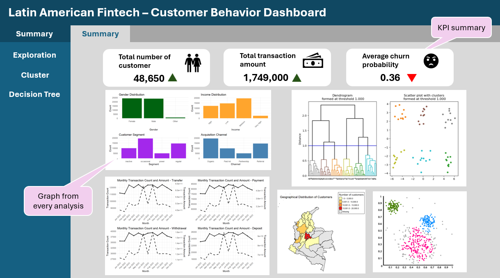
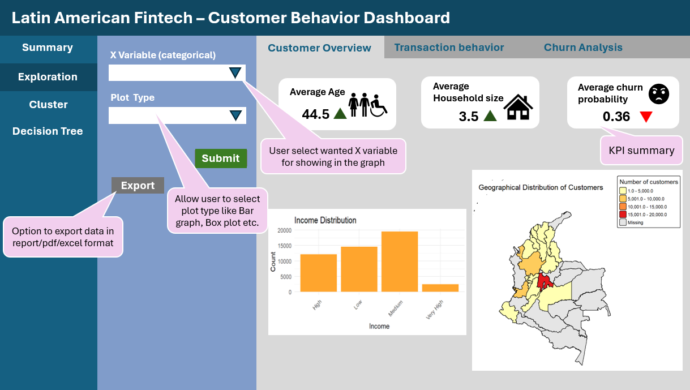
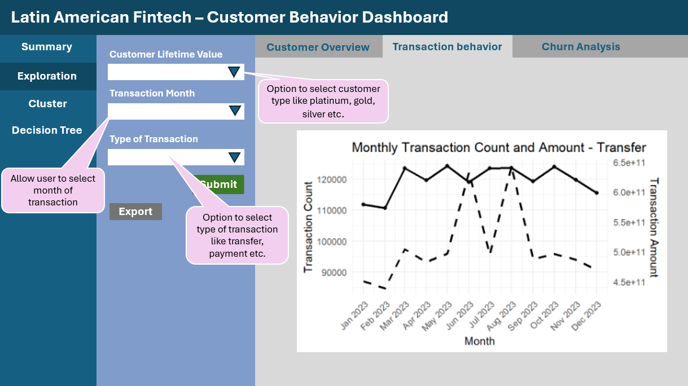
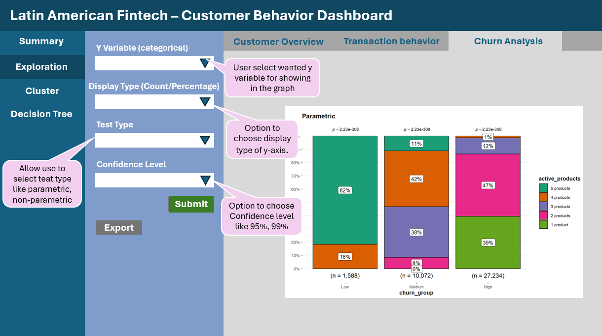
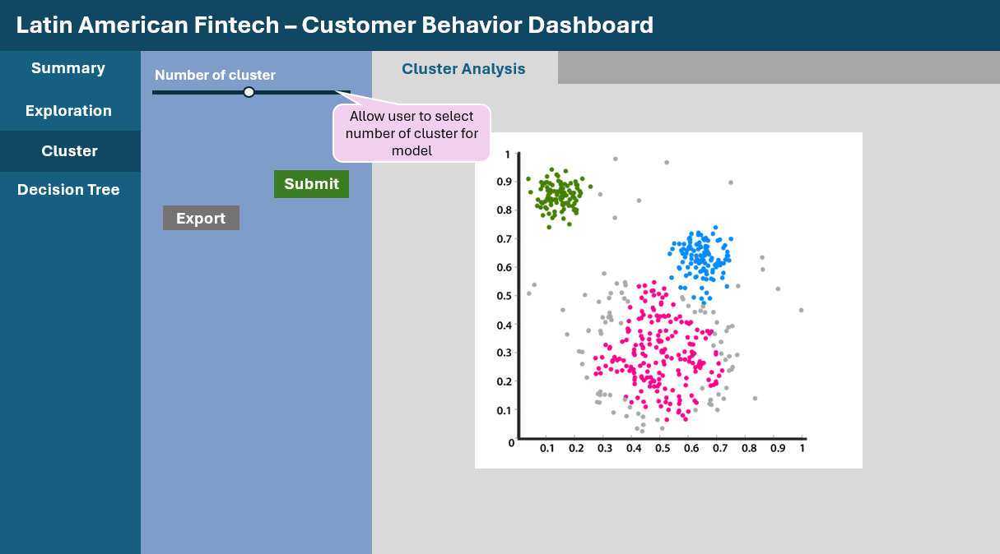
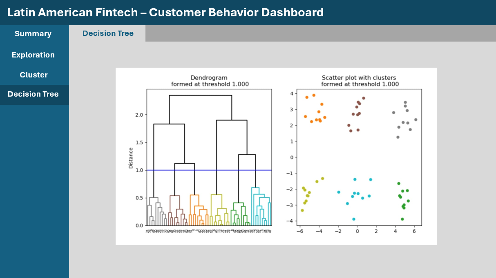

# 1. Overview

## 1.1 Project Brief

Take-home exercise 2 is a preliminary work of the final group project - Customer behavior in Latin American Fintech. In the financial technology (Fintech) industry, understanding customer behavior and identifying factors that influence customer retention and churn have become increasingly important. High customer churn can negatively affect business sustainability and profitability, raising concerns among fintech companies about how to improve customer satisfaction, engagement, and loyalty. Therefore, effective data analysis and visualization are essential to help (1) identify patterns and trends in customer behavior and (2) understand the key factors associated with customer churn.

The project team consists of three members, and each member will take one of the main prototype modules as follows:

-   Exploratory Data Analysis & Confirmatory Data Analysis

-   Cluster Analysis

-   Decision Tree Analysis

## 1.2 Project Objective

The project will be using data from *A comprehensive dataset of customer behavior in Latin American Fintech: 12-month transactional and demographic data for churn analysis* paper. The objective of my assignment is to build a prototype - user interface (UI) design on **Exploratory Data Analysis & Confirmatory Data Analysis** that provides easy-to-use and insightful visualisation tools.

# 2. Data Preparation

## 2.1 Overview of the Data

The dataset contains information on 48,723 customers of a Colombian fintech company, collected over a 12-month period from January 4, 2023, to December 29, 2023. The 48,723 customers represent the complete active customer base for calendar year 2023, making this a comprehensive population study rather than a sample.

The dataset comprises 57 variables categorized into demographics, product usage, transaction records, customer feedback, digital engagement, and derived metrics.

Data are organized in two CSV files with relational structure:

1.  **customer_data.csv:** Contains customer-level information including demographics, product portfolio, satisfaction metrics, and aggregated behavioral features (one row per customer, 48,723 rows).

2.  **transactions_data.csv:** Contains transaction-level data for all customers over the 12-month period (one row per transaction, 3,159,157 rows).

## 2.2 Install and Launch R Packages

The project uses `p_load()` of pacman package to check if the R packages are installed in the computer.

The following code chunk is used to install and launch the R packages.

```{r}
pacman::p_load(dplyr,tidyr,ggplot2,readxl,scales,ggstatsplot,patchwork,lubridate)
```

## 2.3 Import Data

The project will examine *A comprehensive dataset of customer behavior in Latin American Fintech*. There are 2 files which are

```{r}
customer <- read.csv("data/customer_data.csv", na.strings = c("", "NA"))
```

```{r}
transaction <- read.csv("data/transactions_data.csv")
```

## 2.4 Data Cleaning

### 2.4.1 Handling missing value

To examine missing values for each variable individually, the code chunk below was used to compute the number of missing observations by column.

```{r}
colSums(is.na(customer))
```

After inspecting the dataset using c`olSums(is.na(customer))`, only ‘complaint_topics’ (49.97%), ‘credit_utilization_ratio’ (37.48%), and ‘feature_requests’ (33.07%) contain missing values when the corresponding product or interaction is not applicable.

These columns will be dropped using the code chunk below.

```{r}
customer <- customer %>% select(-credit_utilization_ratio)
customer <- customer %>% select(-feature_requests)
customer <- customer %>% select(-complaint_topics)
```

### 2.4.2 Check Data Duplication

For the customer dataset, it is necessary to verify whether the `customer_id` values are duplicated. Each customer should have a unique identifier to ensure data accuracy and consistency.

```{r}
sum(duplicated(customer$customer_id))
```

### 2.4.3 Correct Data Type

#### 2.4.3.1 Check Data Type of Each Column

Checking the data type of each column in a dataset is an essential step in data preprocessing. Different types of analyses and operations require variables to be in the correct format by using the code chunk below.

```{r}
str(customer)
```

#### 2.4.3.2 Correct the data type

The Code chunk below is ot change data type of the variables that have incorrect data type

-   Customer data

```{r}
customer$customer_id <- as.character(customer$customer_id)

customer$first_tx<- as.Date(customer$first_tx)

customer$last_tx <- as.Date(customer$last_tx)

customer$last_survey_date <- as.Date(customer$last_survey_date)

customer$last_transaction_date <- as.Date(customer$last_transaction_date)

customer$first_transaction_date <- as.Date(customer$first_transaction_date)
```

-   Transaction data

```{r}
transaction$date <- as.Date(transaction$date)

transaction <- transaction %>%
  mutate(
    year_month = floor_date(date, "month"),
    year = year(date),
    month = month(date, label = TRUE)
  )
```

#### 2.4.3.3 Recoding categorical variables

Although many variables in the dataset are recorded using numerical codes (e.g., 1–5), these values do not represent actual quantities or measurements but instead correspond to ordered categories or levels of perception. If left as numeric variables, R would treat them as continuous numbers. Therefore, these variables need to be recoded as ordered factors with meaningful labels to ensure accurate and appropriate analysis and visualization by using the code chunk below.

```{r}
customer <- customer |>
  mutate(
    active_products = factor(active_products,
                  levels = c(0,1,2,3,4,5),
                  labels = c("0 product",
                             "1 product",
                             "2 products",
                             "3 products",
                             "4 products",
                             "5 products")),
    satisfaction_score = factor(satisfaction_score,
                  levels = c(2,3,4,5,6),
                  labels = c("Very low",
                             "Low",
                             "Medium",
                             "High",
                             "Very high")),
    app_logins_group = cut(app_logins_frequency,
      breaks = c(0,25,50,100),
      labels = c("Rarely","Often","Always"),
      include.lowest = TRUE))
```

### 2.4.4 Check logic Consistency

Churn_probability should be in \[0,1\] satsfaction_core must in the range \[1,6\]

```{r}
summary(customer)
```

# 3. Exploratory Data Analysis

## 3.1 Check correlation

As a first step in the Exploratory Data Analysis (EDA), correlation analysis is performed to examine the relationships between numerical variables in the dataset. Checking correlations helps identify whether variables are positively or negatively related and how strongly they are associated with each other.

```{r, fig.width=10, fig.height=8}
#| echo: true
#| code-fold: true
#| code-summary: "Code" 

library(corrplot)
corr_matrix <- cor(customer[, sapply(customer, is.numeric)])
corrplot(corr_matrix, method = "color")
```

## 3.2 Customer Profile Overview

The dashboard was developed in R using the `ggplot2`, `dplyr`, and `patchwork` packages. Key performance indicators (KPIs), including total customers, average age, and average household size, were calculated using `nrow()` and `mean()`.

A KPI summary panel was created using `ggplot()` and `annotate()` to display the calculated metrics as text.

For categorical variables such as gender, income bracket, customer segment, and acquisition channel, the `count()` function was used to aggregate frequencies. These results were visualized using bar charts with `geom_bar(stat = "identity")`.

```{r, fig.width=10, fig.height=6}
#| echo: true
#| code-fold: true
#| code-summary: "Code"

total_customers <- nrow(customer)
avg_age <- round(mean(customer$age), 1)
avg_household <- round(mean(customer$household_size), 1)

kpi_plot <- ggplot() +
  annotate("text", x = 1, y = 3,
           label = paste("Total Customers:", total_customers),
           size = 5) +
  annotate("text", x = 1, y = 2,
           label = paste("Average Age:", avg_age),
           size = 5) +
  annotate("text", x = 1, y = 1,
           label = paste("Avg Household Size:", avg_household),
           size = 5) +
  xlim(0, 2) + ylim(0, 4) +
  theme_void()

gender_plot <- customer %>%
  count(gender) %>%
  ggplot(aes(x = gender, y = n)) +
  geom_bar(stat = "identity",fill = "darkgreen") +
  theme_minimal() +
  labs(title = "Gender Distribution",
       x = "Gender", y = "Count")

income_plot <- customer %>%
  count(income_bracket) %>%
  ggplot(aes(x = income_bracket, y = n)) +
  geom_bar(stat = "identity", fill = "orange") +
  theme_minimal() +
  labs(title = "Income Distribution",
       x = "Income", y = "Count") +
  theme(axis.text.x = element_text(angle = 45, hjust = 1))

segment_plot <- customer %>%
  count(customer_segment) %>%
  ggplot(aes(x = customer_segment, y = n)) +
  geom_bar(stat = "identity", fill = "purple") +
  theme_minimal() +
  labs(title = "Customer Segment",
       x = "Segment", y = "Count")

acquisition_plot <- customer %>%
  count(acquisition_channel) %>%
  ggplot(aes(x = acquisition_channel, y = n)) +
  geom_bar(stat = "identity", fill = "steelblue") +
  theme_minimal() +
  labs(title = "Acquisition Channel",
       x = "Channel", y = "Count")

kpi_plot /(gender_plot | income_plot) /(segment_plot | acquisition_plot)
```

::: {.callout-tip title="Insight"}
This dashboard provides a high-level overview of the customer base. The company primarily serves middle-income, middle-aged customers with balanced gender distribution. Most users are occasional or regular users, indicating significant potential to increase engagement. Organic and referral channels are the strongest acquisition drivers, suggesting strong brand presence and customer advocacy.
:::

## 3.3 Transaction Pattern

The transaction data was aggregated at a monthly level to analyze seasonal patterns and transaction trends. Using the `group_by()` function, transactions were grouped by both transaction type and month (`year_month`). For each group, two metrics were calculated: total transaction count (`n()`) and total transaction amount (`sum(amount, na.rm = TRUE)`)

The dataset was then separated into four transaction categories: Transfer, Payment, Withdrawal, and Deposit. For each category, a scaling factor was computed by dividing the maximum transaction count by the maximum transaction amount. This scaling factor was used to align transaction amounts with transaction counts on a secondary y-axis, allowing both metrics to be visualized simultaneously in a single chart.

```{r, fig.width=10, fig.height=6}
#| echo: true
#| code-fold: true
#| code-summary: "Code"

monthly_type <- transaction %>%
  group_by(type, year_month) %>%
  summarise(
    transaction_count = n(),
    transaction_amount = sum(amount, na.rm = TRUE),
    .groups = "drop"
  )

transfer_data <- monthly_type %>%
  filter(type == "Transfer")

payment_data <- monthly_type %>%
  filter(type == "Payment")

withdrawal_data <- monthly_type %>%
  filter(type == "Withdrawal")

deposit_data <- monthly_type %>%
  filter(type == "Deposit")

scale_factor_t <- max(transfer_data$transaction_count) / 
                max(transfer_data$transaction_amount)

scale_factor_p <- max(payment_data$transaction_count) / 
                max(payment_data$transaction_amount)

scale_factor_w <- max(withdrawal_data$transaction_count) / 
                max(withdrawal_data$transaction_amount)

scale_factor_d <- max(deposit_data$transaction_count) / 
                max(deposit_data$transaction_amount)

transfer <- ggplot(transfer_data, aes(x = year_month)) +
  
  # Count (Primary axis)
  geom_line(aes(y = transaction_count), linewidth = 1) +
  geom_point(aes(y = transaction_count)) +
  
  # Amount (Scaled)
  geom_line(aes(y = transaction_amount * scale_factor_t),
            linetype = "dashed",
            linewidth = 1) +
  
  scale_y_continuous(
    name = "Transaction Count",
    
    sec.axis = sec_axis(
      ~ . / scale_factor_t,
      name = "Transaction Amount"
    )
  ) +
  
  scale_x_date(
    date_breaks = "1 month",
    date_labels = "%b %Y"
  ) +
  
  labs(
    title = "Monthly Transaction Count and Amount - Transfer",
    x = "Month"
  ) +
  
  theme_minimal() +
  theme(axis.text.x = element_text(angle = 45, hjust = 1))


payment <- ggplot(payment_data, aes(x = year_month)) +
  
  # Count (Primary axis)
  geom_line(aes(y = transaction_count), linewidth = 1) +
  geom_point(aes(y = transaction_count)) +
  
  # Amount (Scaled)
  geom_line(aes(y = transaction_amount * scale_factor_p),
            linetype = "dashed",
            linewidth = 1) +
  
  scale_y_continuous(
    name = "Transaction Count",
    
    sec.axis = sec_axis(
      ~ . / scale_factor_p,
      name = "Transaction Amount"
    )
  ) +
  
  scale_x_date(
    date_breaks = "1 month",
    date_labels = "%b %Y"
  ) +
  
  labs(
    title = "Monthly Transaction Count and Amount - Payment",
    x = "Month"
  ) +
  
  theme_minimal() +
  theme(axis.text.x = element_text(angle = 45, hjust = 1))


withdrawal <- ggplot(withdrawal_data, aes(x = year_month)) +
  
  # Count (Primary axis)
  geom_line(aes(y = transaction_count), linewidth = 1) +
  geom_point(aes(y = transaction_count)) +
  
  # Amount (Scaled)
  geom_line(aes(y = transaction_amount * scale_factor_w),
            linetype = "dashed",
            linewidth = 1) +
  
  scale_y_continuous(
    name = "Transaction Count",
    
    sec.axis = sec_axis(
      ~ . / scale_factor_w,
      name = "Transaction Amount"
    )
  ) +
  
  scale_x_date(
    date_breaks = "1 month",
    date_labels = "%b %Y"
  ) +
  
  labs(
    title = "Monthly Transaction Count and Amount - Withdrawal",
    x = "Month"
  ) +
  
  theme_minimal() +
  theme(axis.text.x = element_text(angle = 45, hjust = 1))

deposit <- ggplot(deposit_data, aes(x = year_month)) +
  
  # Count (Primary axis)
  geom_line(aes(y = transaction_count), linewidth = 1) +
  geom_point(aes(y = transaction_count)) +
  
  # Amount (Scaled)
  geom_line(aes(y = transaction_amount * scale_factor_d),
            linetype = "dashed",
            linewidth = 1) +
  
  scale_y_continuous(
    name = "Transaction Count",
    
    sec.axis = sec_axis(
      ~ . / scale_factor_d,
      name = "Transaction Amount"
    )
  ) +
  
  scale_x_date(
    date_breaks = "1 month",
    date_labels = "%b %Y"
  ) +
  
  labs(
    title = "Monthly Transaction Count and Amount - Deposit",
    x = "Month"
  ) +
  
  theme_minimal() +
  theme(axis.text.x = element_text(angle = 45, hjust = 1))


(transfer+payment) / (withdrawal+deposit)
```

::: {.callout-tip title="Insight"}
The transaction pattern analysis reveals:

-   Transfer transactions dominate in volume and consistency, with visible peaks around mid-year and early Q4. Seasonal spikes may be linked to business cycles or major financial periods (e.g., mid-year or year-end financial planning).

-   Payment and Deposit categories show stronger seasonal fluctuations, with clear increases in mid-year months.

-   Withdrawal activity is comparatively stable.

-   Deposits show periodic increases in both count and transaction amount, particularly during mid-year and late-year months.

-   Peaks in transaction amount often coincide with peaks in transaction count, suggesting synchronized behavioral patterns rather than isolated high-value transactions.

These findings support the presence of seasonality and provide a strong foundation for further time-series analysis, customer segmentation, and predictive modeling.
:::

## 3.4 Digital Engagement Analysis

The Digital Engagement dashboard was developed using `ggplot2` to summarize user activity, engagement behavior, and retention-related metrics.

First, key engagement KPIs were calculated, including total users (`nrow()`), average app login frequency, average monthly transaction count, average churn probability (formatted as percentage), and average Net Promoter Score (NPS). These metrics provide a high-level overview of platform engagement and customer sentiment.

```{r, fig.width=10, fig.height=7}
#| echo: true
#| code-fold: true
#| code-summary: "Code"
#| 
total_users <- nrow(customer)
avg_logins <- round(mean(customer$app_logins_frequency, na.rm = TRUE),1)
avg_tx_freq <- round(mean(customer$monthly_transaction_count, na.rm = TRUE),2)

kpi_plot <- ggplot() +
  annotate("text", x=1, y=5, label=paste("Total Users:", total_users), size=5) +
  annotate("text", x=1, y=4, label=paste("Avg Logins:", avg_logins), size=5) +
  annotate("text", x=1, y=3, label=paste("Avg Monthly Tx:", avg_tx_freq), size=5) +
  xlim(0,2) + ylim(0,6) +
  theme_void()

login_plot <- ggplot(customer, aes(x = app_logins_frequency)) +
  geom_histogram(bins=10) +
  theme_minimal() +
  labs(title="App Login Frequency Distribution",
       x="Login Frequency",
       y="Users")

feature_plot <- ggplot(customer, aes(x = feature_usage_diversity)) +
  geom_histogram(bins=10) +
  theme_minimal() +
  labs(title="Feature Usage Diversity",
       x="Number of Features Used",
       y="Users")

transaction_plot <- ggplot(customer,
       aes(x = monthly_transaction_count,
           y = total_transaction_volume)) +
  geom_point() +
  theme_minimal() +
  labs(title="Transaction Frequency vs Volume",
       x="Monthly Transaction Count",
       y="Total Transaction Volume")

kpi_plot /(login_plot | feature_plot) / transaction_plot

```

::: {.callout-tip title="Insight"}
-   Most users log in between moderate ranges, while a smaller portion shows very high login frequency.

-   Most users utilize only a limited number of features, with fewer customers exploring a wide range of functionalities.

-   The relationship between login frequency and satisfaction appears relatively weak, as indicated by the nearly flat regression line.

-   There is a visible concentration of customers with moderate churn probability and varying CLV levels.

-   The scatter plot shows a positive relationship between transaction count and total transaction volume.

The Digital Engagement analysis reveals that while customer activity levels are moderate, overall satisfaction and loyalty indicators remain weak. Engagement quantity alone does not guarantee satisfaction, suggesting that improving service quality and user experience may be more impactful than simply increasing login frequency.
:::

## 3.5 Customer Experience

In this section, we explore customer experience by examining key metrics and relationships between engagement, satisfaction, and churn. The average churn probability provide a high-level view of overall customer experience. `geom_point()` are used to visualize how app login frequency relates to satisfaction and how churn probability relates to customer lifetime value (CLV).

```{r, fig.width=8, fig.height=5}
#| echo: true
#| code-fold: true
#| code-summary: "Code"

avg_churn <- percent(mean(customer$churn_probability, na.rm = TRUE))

kpi_plot <- ggplot() +
  annotate("text", x=1, y=2, label=paste("Avg Churn Probability:", avg_churn), size=5) +
  theme_void()

engagement_satisfaction_plot <- ggplot(customer,
       aes(x = app_logins_frequency,
           y = satisfaction_score)) +
  geom_point() +
  geom_smooth(method="lm", se=FALSE) +
  theme_minimal() +
  labs(title="Engagement vs Satisfaction",
       x="App Login Frequency",
       y="Satisfaction Score")

churn_plot <- ggplot(customer,
       aes(x = churn_probability,
           y = customer_lifetime_value)) +
  geom_point() +
  theme_minimal() +
  labs(title="Churn Probability vs CLV",
       x="Churn Probability",
       y="Customer Lifetime Value")

kpi_plot /(engagement_satisfaction_plot | churn_plot) 

```

::: {.callout-tip title="Insight"}
-   The average churn probability across all customers is 34%, indicating a significant portion of the customer base is at risk of leaving.

-   Customer engagement, measured by app login frequency, is positively associated with satisfaction: more frequent logins tend to correspond with higher satisfaction scores.

<!-- -->

-   The churn probability vs. CLV plot shows that most customers have moderate churn probability, but those with higher churn probability generally have lower customer lifetime value (CLV).

-   These findings suggest that improving customer engagement and satisfaction may help reduce churn and protect overall customer value.
:::

## 3.6 Geographical Distribution of Customers

The code chunk below will be used to install and load package for handling geospatial data in RStudio

```{r}
pacman::p_load(sf, tmap)
```

### 3.6.1 Importing Geospatial Data into R

The code chunk below uses the st_read() function of sf package to import gadm41_COL_1 shapefile into R as a simple feature data frame

```{r}
mpsz <- st_read(dsn = "data/geospatial", 
                layer = "gadm41_COL_1")
```

Examine the content of mpsz by using the code chunk below.

```{r}
mpsz
```

### 3.6.2 Joining the attribute data and geospatial data

This code prepares customer location data and joins it with the geographic shapefile of Colombian departments in order to visualize the geographical distribution of customers.

```{r}
#| echo: true
#| code-fold: true
#| code-summary: "Code"

library(dplyr)
library(sf)
library(stringi)

customer <- customer %>%
  mutate(
    department = stri_trim_both(stri_extract_first_regex(location, "(?<=, ).*")),
    department_clean = stri_trans_general(department, "Latin-ASCII")
  )

dept_customer <- customer %>%
  group_by(department_clean) %>%
  summarise(no_customers = n())

mpsz <- mpsz %>%
  mutate(NAME_1_clean = stri_trans_general(NAME_1, "Latin-ASCII"))

mpsz_customers <- mpsz %>%
  left_join(dept_customer, by = c("NAME_1_clean" = "department_clean"))
```

### 3.6.3 Choropleth Mapping Geospatial Data Using *tmap*

```{r}
#| echo: true
#| code-fold: true
#| code-summary: "Code"

library(tmap)

tmap_mode("plot")

tm_shape(mpsz_customers) +
  tm_polygons(
    col = "no_customers",
    border.col = "black",
    palette = "YlOrRd",
    colorNA = "gray90",
    title = "Number of customers"
  ) +
  tm_layout(
    title = "Geographical Distribution of Customers",
    frame = FALSE
  )
```

# 4. Confirmatory Data Analysis

In this section, I will compare the factors that affect churn probability using a parametric method (Chi-square test) and a non-parametric method (Fisher's Exact test).

In the dataset, `churn_probability` is a numerical variable. Therefore, it will be converted into three categories: *low, medium, and high*, using the code chunk below.

```{r}
#| echo: true
#| code-fold: true
#| code-summary: "Code"

library(dplyr)

customer <- customer %>%
  mutate(
    churn_group = cut(
      churn_probability,
      breaks = c(0,0.2,0.3,0.4),
      labels = c("Low","Medium","High"),
      include.lowest = TRUE
    )
  )
```

## 4.1 Churn_probability VS Gender

```{r, fig.width=8, fig.height=10}
#| echo: true
#| code-fold: true
#| code-summary: "Code"

library(ggstatsplot)
p1 <- ggbarstats(customer, gender, churn_group, type="parametric", title = "Parametric")
p2 <- ggbarstats(customer, gender, churn_group, type="nonparametric",title = "Non-parametric")
p1/p2

```

## 4.2 Churn_probability VS Income

```{r, fig.width=8, fig.height=10}
#| echo: true
#| code-fold: true
#| code-summary: "Code"

p3 <- ggbarstats(customer, income_bracket, churn_group, type="parametric", title = "Parametric")
p4 <- ggbarstats(customer, income_bracket, churn_group, type="nonparametric",title = "Non-parametric")
p3/p4

```

## 4.3 Churn_probability VS Education level

```{r, fig.width=8, fig.height=10}
#| echo: true
#| code-fold: true
#| code-summary: "Code"

p5 <- ggbarstats(customer, education_level, churn_group, type="parametric", title = "Parametric")
p6 <- ggbarstats(customer, education_level, churn_group, type="nonparametric",title = "Non-parametric")
p5/p6

```

## 4.4 Churn_probability VS Marital status

```{r, fig.width=8, fig.height=10}
#| echo: true
#| code-fold: true
#| code-summary: "Code"

p7 <- ggbarstats(customer, marital_status, churn_group, type="parametric", title = "Parametric")
p8 <- ggbarstats(customer, marital_status, churn_group, type="nonparametric",title = "Non-parametric")
p7/p8

```

## 4.5 Churn_probability VS Customer segment

```{r, fig.width=8, fig.height=10}
#| echo: true
#| code-fold: true
#| code-summary: "Code"

p9 <- ggbarstats(customer, customer_segment, churn_group, type="parametric", title = "Parametric")
p10 <- ggbarstats(customer, customer_segment, churn_group, type="nonparametric",title = "Non-parametric")
p9/p10

```

## 4.6 Churn_probability VS Savings account

```{r, fig.width=8, fig.height=10}
#| echo: true
#| code-fold: true
#| code-summary: "Code"

p11 <- ggbarstats(customer, savings_account, churn_group, type="parametric", title = "Parametric")
p12 <- ggbarstats(customer, savings_account, churn_group, type="nonparametric",title = "Non-parametric")
p11/p12

```

## 4.7 Churn_probability VS Acquisition channel

```{r, fig.width=8, fig.height=10}
#| echo: true
#| code-fold: true
#| code-summary: "Code"

p13 <- ggbarstats(customer, acquisition_channel, churn_group, type="parametric", title = "Parametric")
p14 <- ggbarstats(customer, acquisition_channel, churn_group, type="nonparametric",title = "Non-parametric")
p13/p14

```

## 4.8 Churn_probability VS Number of active products

```{r, fig.width=8, fig.height=10}
#| echo: true
#| code-fold: true
#| code-summary: "Code"

p15 <- ggbarstats(customer, active_products, churn_group, type="parametric", title = "Parametric")
p16 <- ggbarstats(customer, active_products, churn_group, type="nonparametric",title = "Non-parametric")
p15/p16

```

## 4.9 Churn_probability VS Satisfaction score

```{r, fig.width=8, fig.height=10}
#| echo: true
#| code-fold: true
#| code-summary: "Code"

p17 <- ggbarstats(customer, satisfaction_score, churn_group, type="parametric", title = "Parametric")
p18 <- ggbarstats(customer, satisfaction_score, churn_group, type="nonparametric",title = "Non-parametric")
p17/p18

```

## 4.10 Churn_probability VS Feedback sentiment

```{r, fig.width=8, fig.height=10}
#| echo: true
#| code-fold: true
#| code-summary: "Code"

p19 <- ggbarstats(customer, feedback_sentiment, churn_group, type="parametric", title = "Parametric")
p20 <- ggbarstats(customer, feedback_sentiment, churn_group, type="nonparametric",title = "Non-parametric")
p19/p20
```

## 4.11 Churn_probability VS Customer lifetime value

```{r, fig.width=8, fig.height=10}
#| echo: true
#| code-fold: true
#| code-summary: "Code"

p21 <- ggbarstats(customer, clv_segment, churn_group, type="parametric", title = "Parametric")
p22 <- ggbarstats(customer, clv_segment, churn_group, type="nonparametric",title = "Non-parametric")
p21/p22
```

## 4.12 Churn_probability VS Average login frequency

```{r, fig.width=8, fig.height=10}
#| echo: true
#| code-fold: true
#| code-summary: "Code"

p23 <- ggbarstats(customer, app_logins_group, churn_group, type="parametric", title = "Parametric")
p24 <- ggbarstats(customer, app_logins_group, churn_group, type="nonparametric",title = "Non-parametric")
p23/p24
```

# 5. Storyboard - UI Design

This dashboard is designed to help users explore customer behavior in a Latin American fintech platform. The storyboard structure guides users from a high-level overview to deeper analysis, including customer demographics, transaction patterns, customer segmentation, and churn analysis.

The dashboard contains four main sections:

1.  Summary

2.  Exploration

3.  Cluster Analysis

4.  Decision Tree Analysis

Each page allows users to interact with the data through filters, visualizations, and statistical analysis.

## 5.1 Summary tab

The Summary page provides a high-level overview of the customer dataset and key business metrics. It allows users to quickly understand the overall status of the customer base before exploring detailed analysis.



At the top of the dashboard, three Key Performance Indicators (KPIs) summarize important metrics. These KPIs help decision-makers quickly assess the overall performance of the fintech platform.

Below the KPI section, several charts provide an overview of customer characteristics and behaviors. These visualizations provide a quick understanding of the customer base and highlight patterns that may require further investigation.

## 5.2 Exploration tab

The Exploration page allows users to perform Exploratory Data Analysis (EDA) by dynamically selecting variables and visualization types and the confirmatory Data Analysis page allows users to statistically validate relationships between variables. This page helps users explore relationships between different customer attributes.

### 5.2.1 Customer overview tab

The main goal of this page is to allow users to interactively explore customer characteristics and distributions.



At the top of the dashboard, three Key Performance Indicators (KPIs) summarize important metrics. These metrics provide quick insights into customer demographics and risk levels.

#### Variable Selection

There are a filter bar that users can choose a categorical variable (X variable) from the dropdown menu to display in the visualization.

Examples include:

-   Gender

-   Income bracket

-   Education level

-   Customer segment

-   Acquisition channel

This allows users to explore how different customer characteristics are distributed.

#### Plot Type Selection

Users can choose different visualization types such as bar chart, box plot, and other chart types

This flexibility helps users view the data from different perspectives

#### Export Option

This allows users to easily share findings with stakeholders.

#### Geographic Distribution

A map visualization displays the geographical distribution of customers across regions, helping identify areas with higher customer concentration.

### 5.2.2 Transaction behavior tab

The Transaction Behavior tab allows users to analyze customer transaction patterns over time. This page focuses on understanding how different customer segments perform in terms of transaction activity and transaction value.

By allowing users to filter the data based on customer value segments, time periods, and transaction types, this page helps identify behavioral patterns and usage trends within the fintech platform.



#### Customer Lifetime Value Selection

Users can select a Customer Lifetime Value (CLV) segment from the dropdown menu. This filter allows users to analyze how transaction behavior differs across customer value tiers. For example, higher-value customers may show higher transaction frequency or larger transaction amounts.

#### Month Selection

Users can select the month or time period of transactions to focus on specific periods of activity.

#### Transaction Type Selection

Users can filter the data based on type of transaction, such as:

-   Transfer

-   Payment

-   Withdrawal

-   Deposit

This feature helps users understand which types of financial activities are most common among customers.

The results are displayed using two line graphs in one plot which are transaction count line and transaction amount line. These will helps identify transaction frequency trends.

### 5.2.3 Churn analysis tab

The objective of this page is to allow users to confirm statistically significant relationships between customer attributes and churn risk. Instead of only visual exploration, this page also enables hypothesis testing.



#### Y Variable Selection

Users can choose a categorical variable for the Y-axis to analyze relationships with churn groups.

Examples include:

-   Active products

-   Customer segments

-   Income level

-   Education level

#### Display Type Selection

Users can choose how the results are displayed whether they want to see data in count or percentage value. This helps users interpret the results based on absolute numbers or proportions.

#### Statistical Test Selection

Users can choose the statistical test type which are parametric teat or non-parametric test which determines the significance threshold used in the hypothesis test.

The results are displayed using stacked bar charts, showing the distribution of variables across churn probability groups.

## 5.3 Cluster Analysis tab

The Cluster Analysis tab allows users to explore customer segmentation using clustering techniques. The objective of this page is to identify groups of customers with similar characteristics or behaviors. By understanding these segments, businesses can develop more targeted marketing strategies and improve customer engagement.



#### Number of Clusters Selection

Users can select the number of clusters (k) from a slide bar. This feature allows users to experiment with different segmentation levels.

The clustering results are displayed using a scatter plot visualization, where each point represents a customer and colors represent different clusters.

## 5.4 Decision tree tab

The Decision tree tab is designed to identify the key factors that influence customer churn probability. This page uses a decision tree model to analyze relationships between customer attributes and churn risk.



The main output of this page is a decision tree diagram that illustrates how customers are classified into different churn probability groups based on their characteristics.

Each branch of the tree represents a decision rule based on a specific variable, while each node represents a split in the data that separates customers into different groups.

This visualization helps users easily interpret how different customer attributes influence churn risk.

# 6. Reference

<https://www.sciencedirect.com/science/article/pii/S2352340926000375>

<https://giniceseah.netlify.app/posts/2021-07-31-storyboard/>

<https://r4va.netlify.app/chap21>
