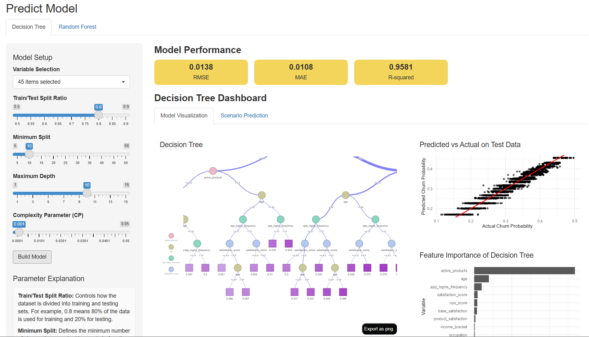
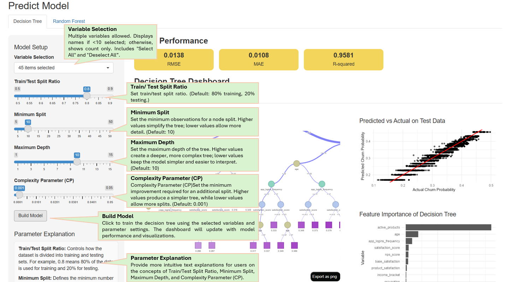
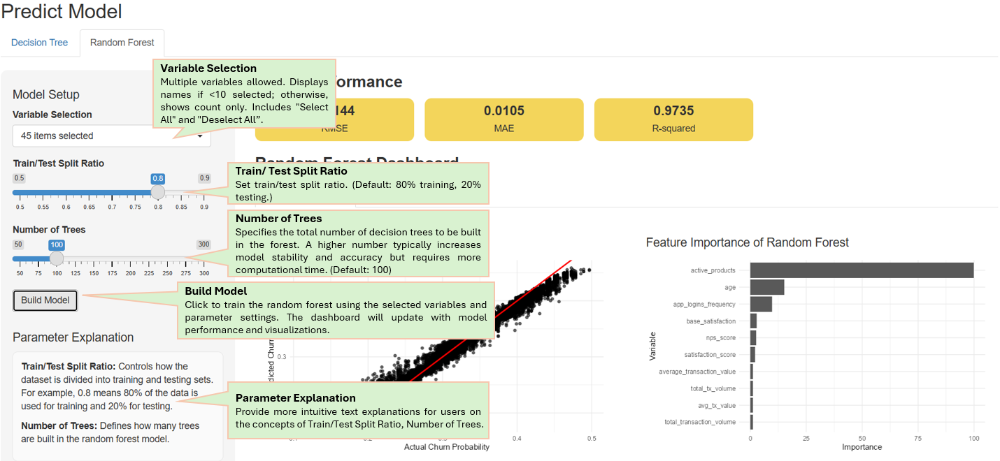
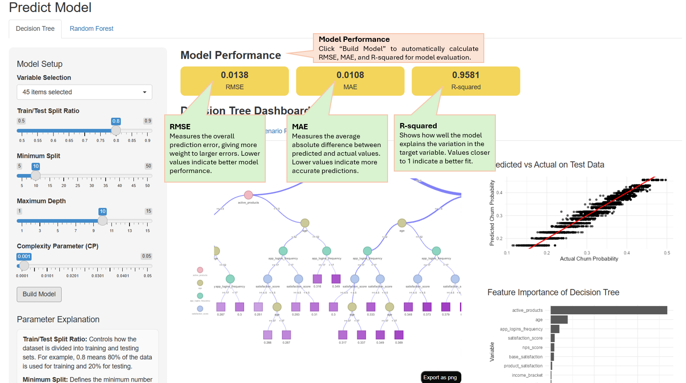
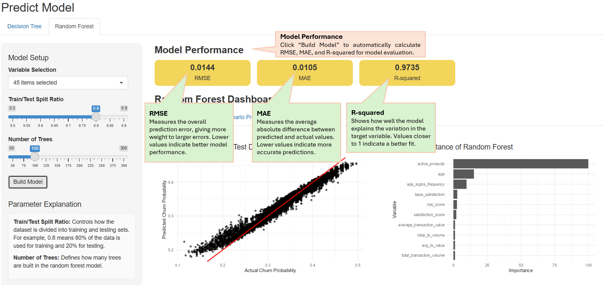
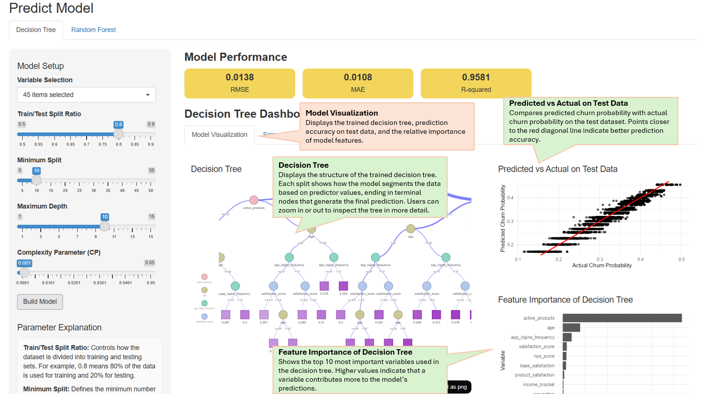
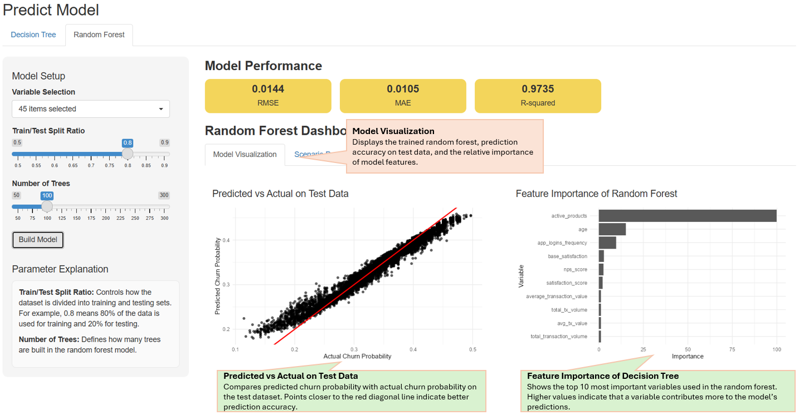
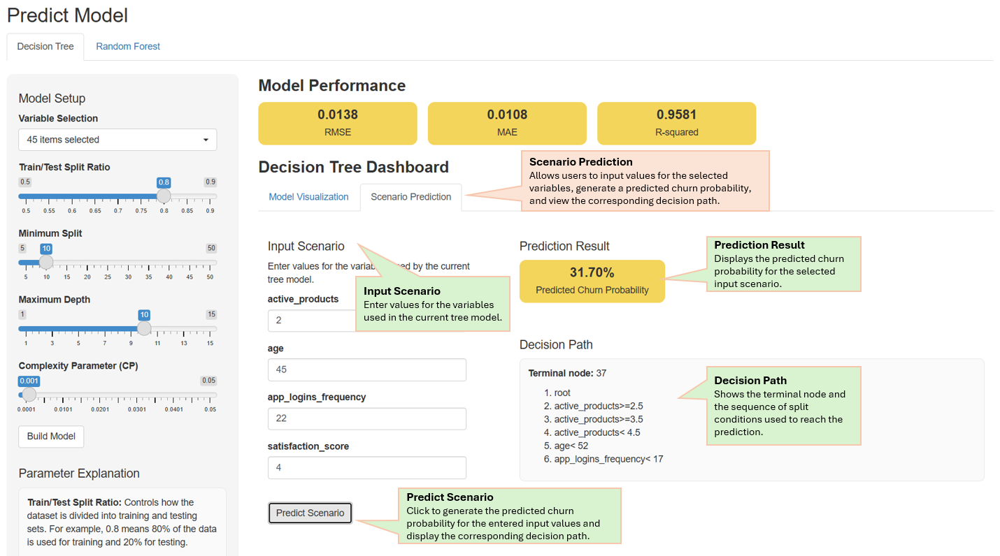
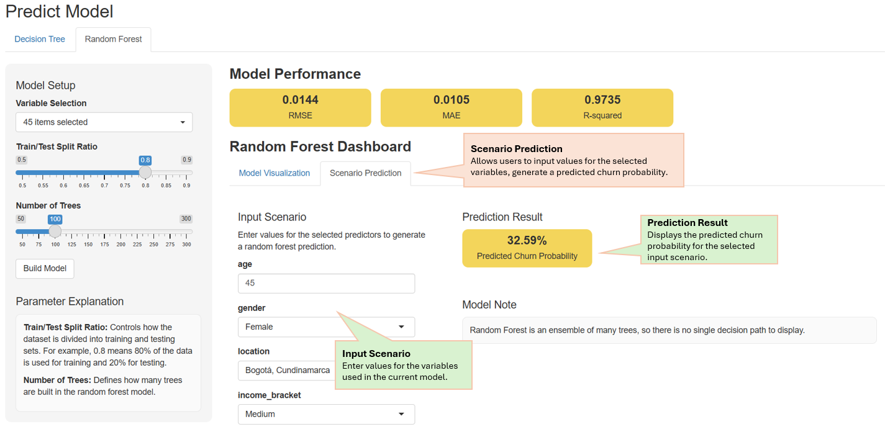

# Load Packages and Data

```{r}
pacman::p_load(tidyverse, rpart, rpart.plot, sparkline, visNetwork, 
               caret, ranger, patchwork)
```

```{r}
customer_data <- read_csv("data/customer_data.csv") 
```

# Data Pre-processing

```{r}
glimpse(customer_data)
```

## Check for duplicates

```{r}
duplicate_count <- sum(duplicated(customer_data))

if (duplicate_count > 0) {
  message("There are ", duplicate_count, " duplicate rows in the dataset.")
} else {
  message("There are no duplicate rows in the dataset.")
}
```

A quick check for duplicate records confirms that there are no duplicated customer IDs in the customer dataset.

## check and handle missing value

```{r}
na_summary <- data.frame(
  column_name = names(customer_data),
  na_count = sapply(customer_data, function(x) sum(is.na(x))),
  na_percentage = sapply(customer_data, function(x) mean(is.na(x)) * 100)
)

na_summary %>%
  filter(na_count > 0)
```

The variables `credit_utilization_ratio` and `feature_requests` were removed from the dataset due to their relatively high proportion of missing values. For the variable `complaint_topics`, missing values were interpreted as cases where customers did not report any specific complaints. Therefore, these missing entries were recoded as "No complaint".

```{r}
customer_data <- customer_data %>% select(-credit_utilization_ratio, -feature_requests)
customer_data <- customer_data %>%
  mutate(
    complaint_topics = ifelse(is.na(complaint_topics),
                              "No complaint",
                              complaint_topics)
  )
```

## Confirm data type of target variable

The target variable churn_probability was checked before modeling. The summary statistics indicate that the variable ranges from 0.114 to 0.501 and is stored as a numeric type, confirming that a regression tree is appropriate for this analysis.

```{r}
summary(customer_data$churn_probability)
class(customer_data$churn_probability)
```

## Convert Character Variables to Factors

All character variables were converted into factor type so that they can be correctly treated as categorical variables in the decision tree model.

```{r}
customer_data <- customer_data %>%
  mutate(across(where(is.character), as.factor))
```

## Remove unnecessary attributes

Several attributes were removed during the preprocessing stage to improve model reliability. First, customer_id was removed because it represents a unique identifier for each customer. Including such variables in the model would not contribute to predictive power and may lead to overfitting.

In addition, `first_tx` and `first_transaction_date` were identified as duplicated attributes describing the customer's first transaction date. Since the first transaction timing is considered to have limited interpretability for predicting churn behavior in the current analysis, these variables were removed.

Similarly, `last_tx` and `last_transaction_date` share the same definition of the customer's most recent transaction date. However, inconsistencies were observed between the two columns. To avoid potential misuse of ambiguous information, both variables were excluded from the modeling dataset.

The variable `last_survey_date` was removed from the model because its date format is incompatible with decision tree algorithms. Furthermore, initial assessments indicated that the specific date of the last survey has no direct correlation with churn probability, making it a redundant feature for this analysis.

```{r}
customer_data <- customer_data %>%
  select(
    -customer_id,
    -first_tx,
    -first_transaction_date,
    -last_tx,
    -last_transaction_date,
    -last_survey_date
  )
```

```{r}
glimpse(customer_data)
```

## Export RDS file for shiny

```{r}
write_rds(customer_data, "data/customer_data_clean.rds")
```

```{r}
customer_data_clean <- read_rds("data/customer_data_clean.rds")
glimpse(customer_data_clean)
```

# Decision Tree

## Train-Test Split

The Shiny application allows users to customize the train-test split ratio. By default, the system is configured with an 80/20 split, allocating 80% of the dataset for training and the remaining 20% for testing.

```{r}
set.seed(1234)

train_index <- createDataPartition(
  customer_data_clean$churn_probability,
  p = 0.8,
  list = FALSE
)

df_train <- customer_data_clean[train_index, ]
df_test  <- customer_data_clean[-train_index, ]
```

## Build Regression Tree Function

Since the target variable `churn_probability` is a continuous variable, we implemented a regression tree rather than a classification tree. In the current code, the model training function is parameterized specifically for min_split, complexity_parameter, and max_depth. Looking ahead, the Shiny application will expand this flexibility, allowing users to not only tune these parameters but also select their own set of predictors and customize the data partition ratio.

```{r}
tree_model <- function(min_split, complexity_parameter, max_depth) {
  rpart(
    churn_probability ~ .,
    data = df_train,
    method = "anova",
    control = rpart.control(
      minsplit = min_split,
      cp = complexity_parameter,
      maxdepth = max_depth
    )
  )
}

fit_tree <- tree_model(min_split = 10, complexity_parameter = 0.001, max_depth = 10
)
```

## View Regression Tree

```{r}
visTree(fit_tree, edgesFontSize = 14, nodesFontSize = 16, width = "100%")
```

## Predict on Test Data

```{r}
df_test$pred_tree <- predict(fit_tree, newdata = df_test)
```

## Predicted vs Actual on Test Data

To evaluate the predictive performance, a scatter plot of predicted versus actual churn probabilities was constructed. The strong alignment of data points along the 45-degree reference line demonstrates the high reliability of the regression tree in estimating churn risks.

```{r}
ggplot(df_test, aes(x = churn_probability, y = pred_tree)) +
  geom_point(alpha = 0.6) +
  geom_abline(slope = 1, intercept = 0, color = "red", linewidth = 1) +
  labs(
    title = "Predicted vs Actual on Test Data",
    x = "Actual Churn Probability",
    y = "Predicted Churn Probability"
  ) +
  theme_minimal(base_size = 13)
```

## Feature Importance of Decision Tree

We extract the variable.importance attribute from the fit_tree model and convert it into a structured table format for easier processing. The variables are then sorted in descending order based on their importance scores, and only the top 10 most influential features are retained. This approach prevents the visualization from becoming overcrowded and ensures that the most critical drivers of the model are clearly highlighted.

```{r}
tree_importance <- tibble(
  Variable = names(fit_tree$variable.importance),
  Importance = as.numeric(fit_tree$variable.importance)
) %>%
  arrange(desc(Importance))

tree_importance %>%
  slice_head(n = 10) %>%
  ggplot(aes(x = reorder(Variable, Importance), y = Importance)) +
  geom_col() +
  coord_flip() +
  labs(
    title = "Feature Importance of Decision Tree",
    x = "Variable",
    y = "Importance"
  ) +
  theme_minimal(base_size = 13)
```

## Model Performance Metrics

This code segment calculates key performance metrics to evaluate the accuracy of our regression model on the testing dataset:

RMSE (Root Mean Square Error): Measures the average magnitude of the error by taking the square root of average squared differences. It is particularly sensitive to large outliers.

MAE (Mean Absolute Error): Represents the average absolute difference between predicted and actual values, offering a more intuitive measure of prediction error.

R-squared ($R^2$): Calculated as the square of the correlation between predicted and actual values. It indicates the proportion of variance in churn_probability explained by the model.

Looking forward, these performance metrics will be integrated into the Shiny application dashboard. This will allow users to monitor the model's accuracy in real-time as they adjust parameters or update datasets.

```{r}
rmse_value <- sqrt(mean((df_test$churn_probability - df_test$pred_tree)^2))
mae_value  <- mean(abs(df_test$churn_probability - df_test$pred_tree))
r2_value   <- cor(df_test$churn_probability, df_test$pred_tree)^2

tibble(
  Metric = c("RMSE", "MAE", "R-squared"),
  Value = round(c(rmse_value, mae_value, r2_value), 4)
)
```

# Random Forest

## Train-Test Split

Similar to the decision tree model, the Shiny application allows users to customize the train-test split ratio for the random forest model. By default, the current implementation also uses an 80/20 split, where 80% of the dataset is allocated to the training set and the remaining 20% is reserved for testing.

```{r}
set.seed(1234)

train_index_rf <- createDataPartition(
  customer_data_clean$churn_probability,
  p = 0.8,
  list = FALSE
)

df_train_rf <- customer_data_clean[train_index_rf, ]
df_test_rf  <- customer_data_clean[-train_index_rf, ]
```

## Build Random Forest Function

we use the ranger engine through the caret framework. The current code is parameterized for the number of trees, allowing the model complexity to be adjusted. After the Shiny application will allow users to choose their own predictors, customize the train-test split ratio, and modify the number of trees interactively.

```{r}
rf_grid <- expand.grid(
  mtry = max(1, floor(sqrt(ncol(df_train_rf) - 1))),
  splitrule = "variance",
  min.node.size = 5
)

rf_control <- trainControl(method = "none")

rf_model <- function(num_trees) {
  train(
    churn_probability ~ .,
    data = df_train_rf,
    method = "ranger",
    trControl = rf_control,
    tuneGrid = rf_grid,
    num.trees = num_trees,
    importance = "impurity"
  )
}

fit_rf <- rf_model(num_trees = 100)
```

## Predict on Test Data

```{r}
df_test_rf$pred_rf <- predict(fit_rf, newdata = df_test_rf)
```

## Predicted vs Actual on Test Data

To evaluate the predictive performance, a scatter plot of predicted versus actual churn probabilities was constructed. Similar to the decision tree model, a strong concentration of points around the 45-degree reference line indicates that the random forest model is able to generate reliable estimates of churn risk.

```{r}
ggplot(df_test_rf, aes(x = churn_probability, y = pred_rf)) +
  geom_point(alpha = 0.6) +
  geom_abline(slope = 1, intercept = 0, color = "red", linewidth = 1) +
  labs(
    title = "Predicted vs Actual on Test Data",
    x = "Actual Churn Probability",
    y = "Predicted Churn Probability"
  ) +
  theme_minimal(base_size = 13)
```

## Feature Importance of Random Forest

We extract the variable importance scores from the fitted random forest model using the `varImp()` function and convert them into a structured table format for easier interpretation. The variables are then sorted in descending order according to their importance scores, and only the top 10 most influential features are displayed.

```{r}
rf_importance <- varImp(fit_rf)$importance %>%
  tibble::rownames_to_column("Variable") %>%
  rename(Importance = Overall) %>%
  arrange(desc(Importance))

rf_importance %>%
  slice_head(n = 10) %>%
  ggplot(aes(x = reorder(Variable, Importance), y = Importance)) +
  geom_col() +
  coord_flip() +
  labs(
    title = "Feature Importance of Random Forest",
    x = "Variable",
    y = "Importance"
  ) +
  theme_minimal(base_size = 13)
```

## Model Performance Metrics

The concept is same as decision tree metrics.

```{r}
rmse_value_rf <- sqrt(mean((df_test_rf$churn_probability - df_test_rf$pred_rf)^2))
mae_value_rf  <- mean(abs(df_test_rf$churn_probability - df_test_rf$pred_rf))
r2_value_rf   <- cor(df_test_rf$churn_probability, df_test_rf$pred_rf)^2

tibble(
  Metric = c("RMSE", "MAE", "R-squared"),
  Value = round(c(rmse_value_rf, mae_value_rf, r2_value_rf), 4)
)
```

# UI Design Introduction

This Predict Model Shiny app enables users to construct either a Decision Tree or a Random Forest model by selecting input variables and tuning key hyperparameters. Users can adjust the train/test split ratio for both models, as well as model-specific parameters such as minimum split, maximum depth, and complexity parameter (for Decision Tree), or the number of trees (for Random Forest).

Upon model completion, the app provides comprehensive performance metrics, including RMSE, MAE, and R-squared. It also features interactive visualizations: the Decision Tree structure (exclusive to the tree model), the distribution of predicted vs. actual values, and feature importance (available for both). To enhance practical utility, a “Scenario Prediction” section is integrated, allowing users to input specific values and obtain real-time predictions based on the active model.



## Control Panel

The Left Control Panel allows users to adjust key model settings, including variable selection and the train/test split ratio for both models. Additionally, users can modify model-specific parameters: minimum split, maximum depth, and complexity parameter (for Decision Tree), or the number of trees (for Random Forest). It also includes parameter definitions to help users better understand the technical meaning and impact of each setting.

-   Decision Tree

    

<!-- -->

-   Random Forest

    

## Model Performance

This section summarizes how well the decision tree performs on the test dataset. After clicking “Build Model,” the app automatically calculates RMSE, MAE, and R-squared to evaluate prediction accuracy and overall model fit.

-   Decision Tree

    

-   Random Forest

    

## Model Visualization

Displays the main visual outputs of the trained model, including the tree structure (for Decision Tree), predicted vs actual results on the test dataset, and the top 10 most important variables. This section helps users interpret model behavior and evaluate prediction performance.

-   Decision Tree

    

-   Random Forest

    

## Scenario Prediction

Allows users to test a custom scenario by entering values for the variables used in the current model. The app then generates the predicted churn probability and displays the corresponding terminal node and decision path.

-   Decision Tree

    

-   Random Forest

    
