# Summary page

**Step 1:** User click **Summary** from the left sidebar menu.

**Step 2:** The dashboard will automatically display overall customer churn indicators, key insights, and summary visualisations.

**Step 3:** User can hover over each interactive chart to view detailed values such as average churn probability and customer count.

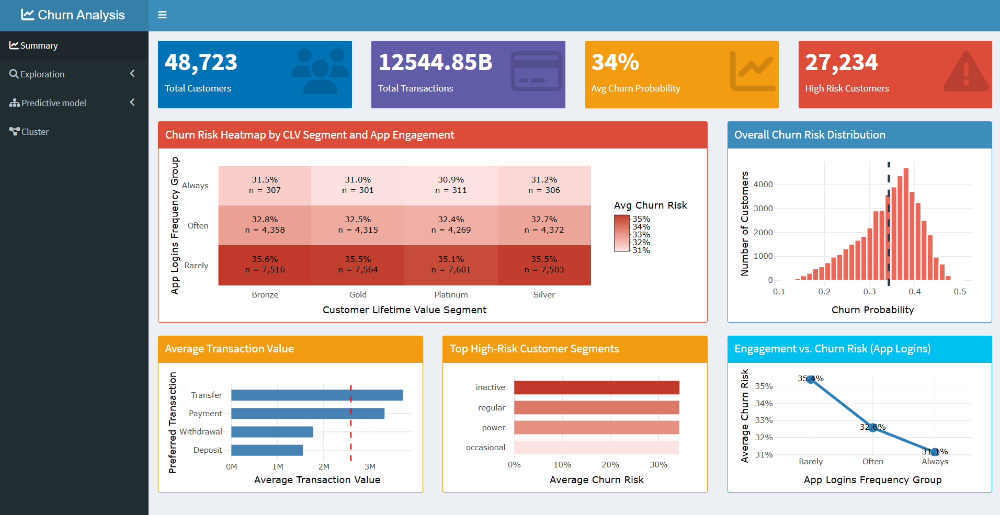

### Output Result

The result will be divided into 4 sections which are KPI Cards, Key Insight, Main Insight Charts, and Supporting Insight Charts.

## 1. KPI Cards

The KPI cards provide a quick overview of the overall customer churn situation.

| KPI Card | Description |
|----|----|
| Total Customers | Shows the total number of customers in the dataset. |
| Total Transactions | Shows the total transaction volume of all customers. |
| Avg Churn Probability | Shows the average churn probability across all customers. |
| High Risk Customers | Shows the number of customers whose churn risk is classified as **High**. |

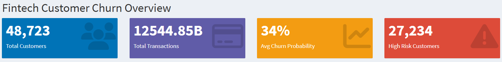

## 2. Main Insight Charts

The main insight charts focus on the overall churn pattern and the highest-risk customer groups.

| Chart | Description |
|----|----|
| Churn Risk Heatmap by CLV Segment and App Engagement | Shows the average churn probability across combinations of **CLV segment** and **app engagement group**. Darker color indicates higher churn risk. |
| Overall Churn Risk Distribution | Shows the overall distribution of churn probability for all customers. A dashed vertical line indicates the average churn probability. |

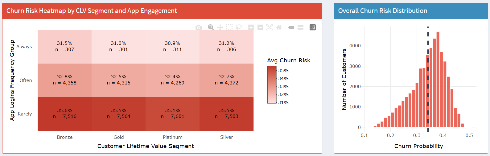

## 3. Supporting Insight Charts

The supporting insight charts provide additional breakdowns of churn risk from different perspectives.

| Chart | Description |
|----|----|
| Average Transaction Value | Shows the average transaction value across different preferred transaction types such as Transfer, Payment, Withdrawal, and Deposit. |
| Top High-Risk Customer Segments | Shows the top customer segments with the highest average churn probability. |
| Engagement vs. Churn Risk (App Logins) | Shows how average churn probability changes across different app login frequency groups such as **Rarely, Often, and Always**. |

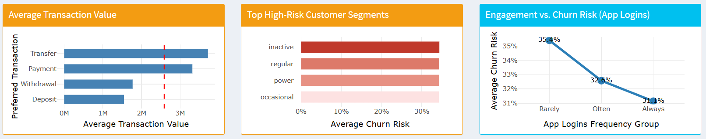

# Exploration page

## 1. Customer Overview

**Step 1:** Select X-axis data Type ( Categorical or Numerical )

**Step 2:** User must choose which X variable to be analyze ( The shown variable will depend on the data type that user choose)

**Step 3:** Select Y-axis data Type ( Categorical or Numerical )

**Step 4:** User must choose which Y variable to be analyze ( The shown variable will depend on the data type that user choose)

**Step 5:** User click update plot

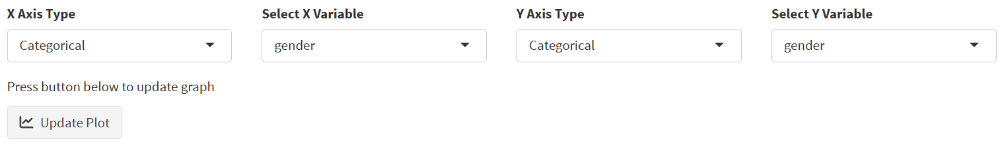

### Output Result

The result is depending on whether th chosen variables are numerical or categorical

+-----------------+--------------------------------------+
| Variable Type   | Result                               |
+=================+======================================+
| X = Categorical | Heatmap                              |
|                 |                                      |
| Y = Categorical | 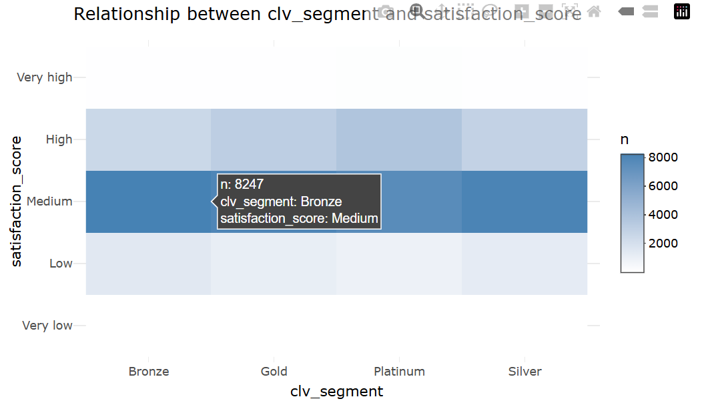  |
+-----------------+--------------------------------------+
| X = Categorical | Box plot                             |
|                 |                                      |
| Y = Numerical   | 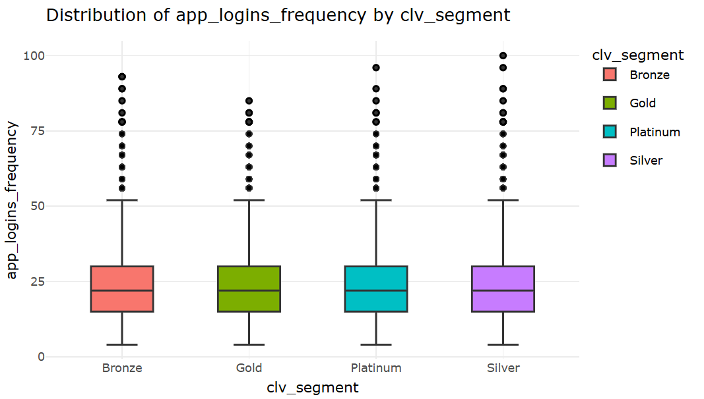   |
+-----------------+--------------------------------------+
| X = Numerical   | Scatter plot                         |
|                 |                                      |
| Y = Numerical   | 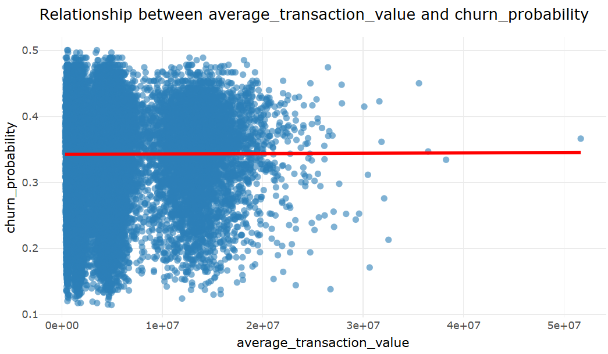 |
+-----------------+--------------------------------------+
| X = Numerical   | Box plot                             |
|                 |                                      |
| Y = Categorical | 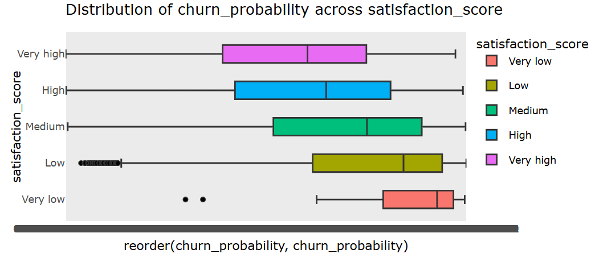  |
+-----------------+--------------------------------------+

## 2. Transaction Behavior

**Step 1:** Select customer lifetime value ( Gold, Platinum, Silver, Bronze )

**Step 2:** Select transaction ( Transfer, Withdrawal , Payment, Deposit )

**Step 3:** User can choose transaction period

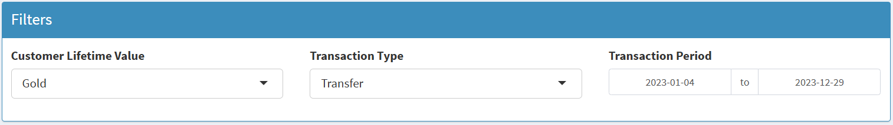

### Output Result

The result will show transaction count in line chart and transaction amount in dash line chart.

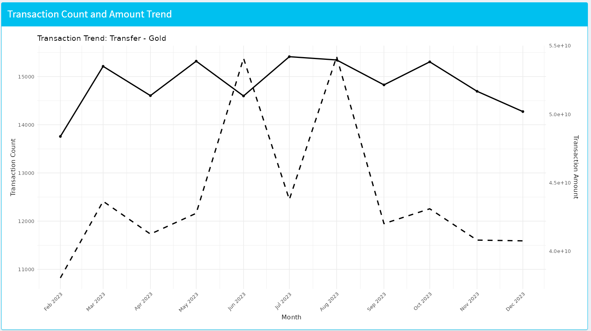

## 3. Churn Analysis

**Step 1:** User must choose which X variable to be analyze

**Step 2:** Select statistical test ( Parametric, Nonparametric, Robust, Bayes )

**Step 3:** Select confident level ( 95%, 99% )

**Step 4:** Select display type ( Count, Percent )

**Step 5:** User click update plot

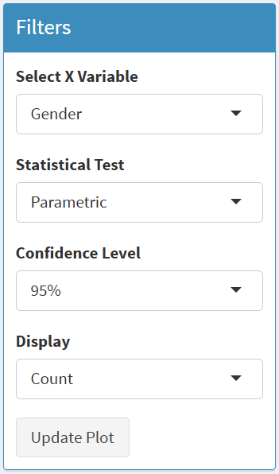

### Output Result

The result will be divided into 2 tabs which are Statistical Test and VCD Mosaic. The graph shows statistical relationship between churn probability and the variable that user choose.

| Statistical Test                     | VCD Mosaic                           |
|--------------------------------------|--------------------------------------|
| 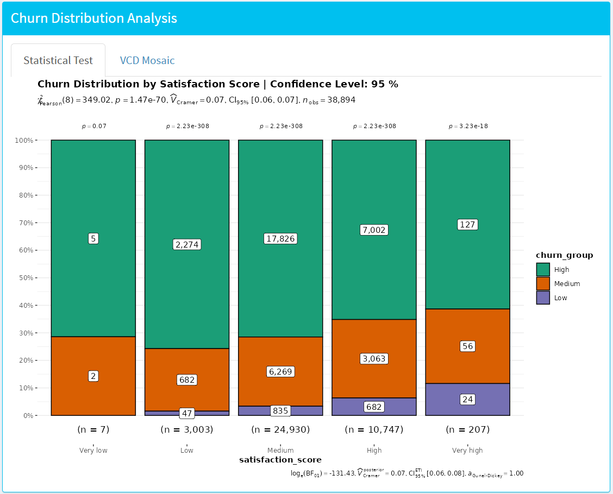 | 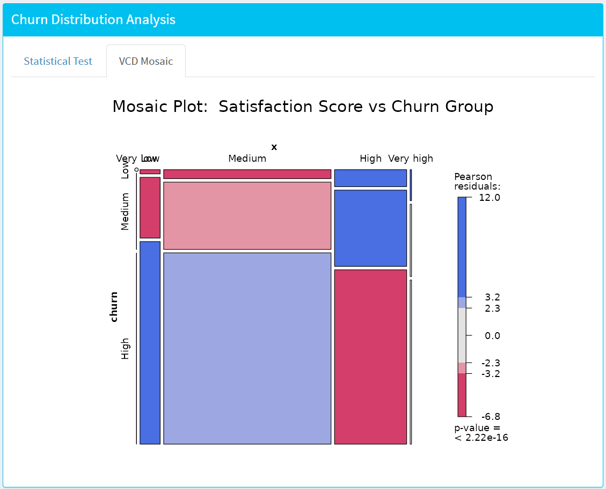 |

# Predictive model page

## 1. Decision tree

**Step 1:** User must choose at least 2 variables and up to 45 variables to be analyze in the model

**Step 2:** User set model parameter

The table below details parameters that can be adjusted to tune the decision tree model.

| Model Parameter | Parameter Description |
|----|----|
| 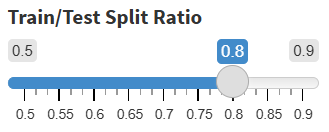 | Controls how the dataset is divided into training and testing sets. For example, 0.8 means 80% of the data is used for training and 20% for testing. |
| 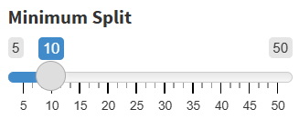 | Defines the minimum number of observations required in a node before the tree can split. |
| 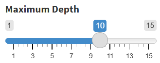 | Sets the maximum number of levels the tree can grow. Deeper trees are more flexible but may overfit. |
| 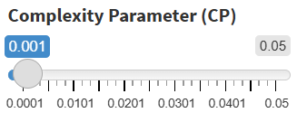 | Controls whether a split is worthwhile. Higher CP makes the tree simpler, lower CP allows more splits. |

**Step 3:** User click build model

### Output Result

The result will show model performance and model visulisation.

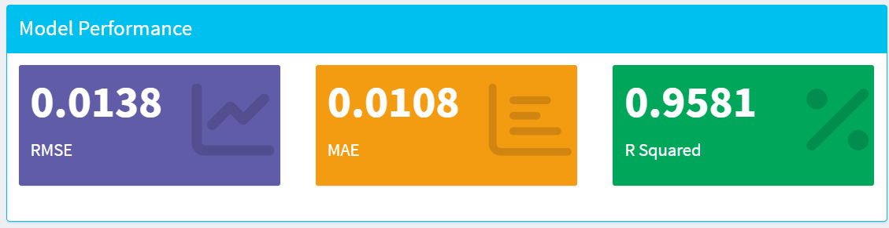

The Model visulisation will be divided into 4 tabs which are Decision Tree, Predicted vs Actual, Feature Importance, and Scenario Prediction.

+---------------------------------------------------+---------------------------------------------------------------------------------------------------------------------------------------------------------------------+
| Model Visulisation                                | Description                                                                                                                                                         |
+===================================================+=====================================================================================================================================================================+
| Decision Tree                                     | The output result show the tree diagram which user can zoom in to the wanted node and can click Rules to show condition.                                            |
|                                                   |                                                                                                                                                                     |
| 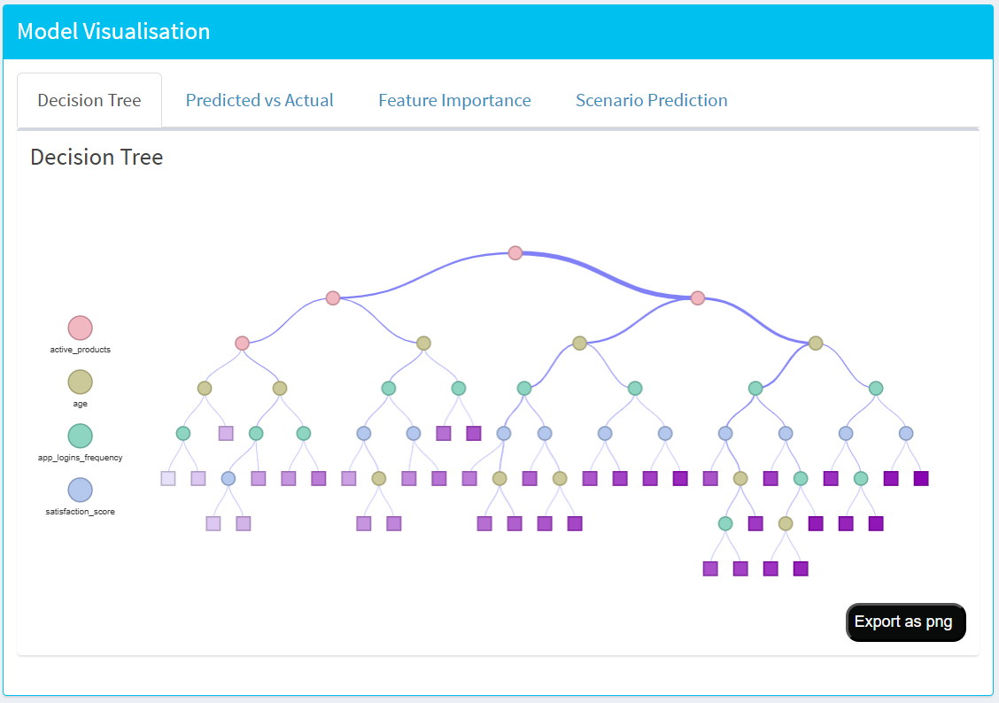              | 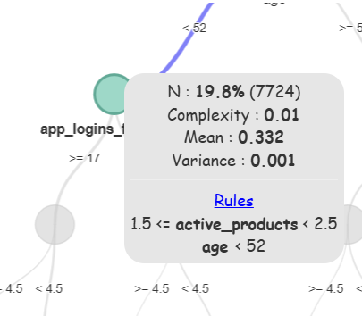{width="274"}                                                                                                                   |
+---------------------------------------------------+---------------------------------------------------------------------------------------------------------------------------------------------------------------------+
| Predicted vs Actual                               | Compares predicted churn probability with actual churn probability on the test dataset. Points closer to the red diagonal line indicate better prediction accuracy. |
|                                                   |                                                                                                                                                                     |
| 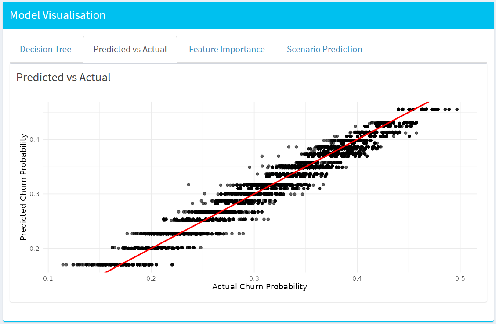              |                                                                                                                                                                     |
+---------------------------------------------------+---------------------------------------------------------------------------------------------------------------------------------------------------------------------+
| Feature Importance                                | Shows the top 10 most important variables used in the decision tree. Higher values indicate that a variable contributes more to the model’s predictions.            |
|                                                   |                                                                                                                                                                     |
| 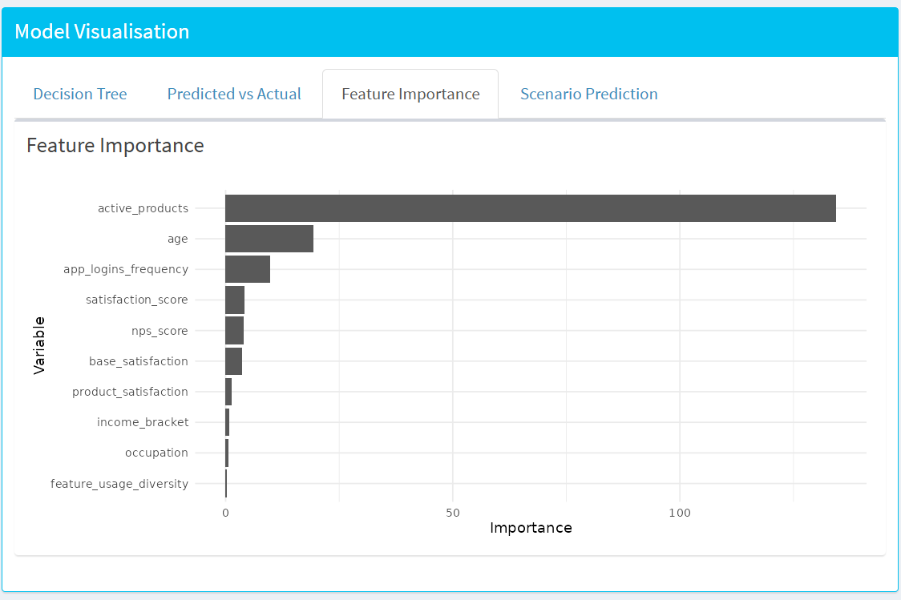              |                                                                                                                                                                     |
+---------------------------------------------------+---------------------------------------------------------------------------------------------------------------------------------------------------------------------+
| Scenario Prediction                               | **Step 1:** User select input scenario                                                                                                                              |
|                                                   |                                                                                                                                                                     |
| 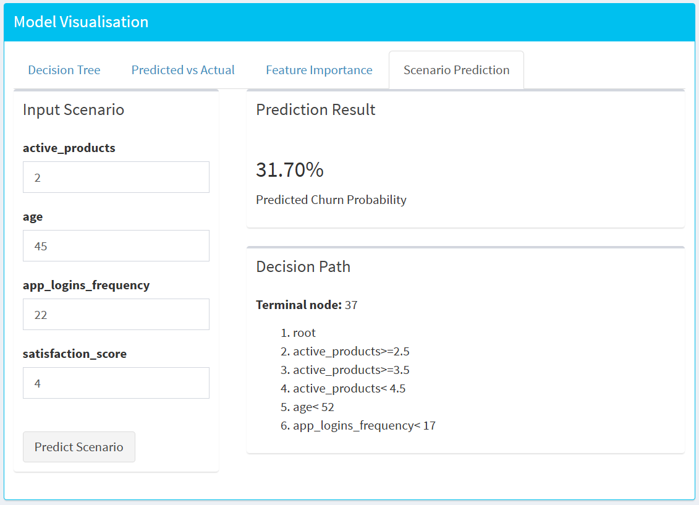{width="439"} | **Step 2:** User click Predict Scenario                                                                                                                             |
|                                                   |                                                                                                                                                                     |
|                                                   | 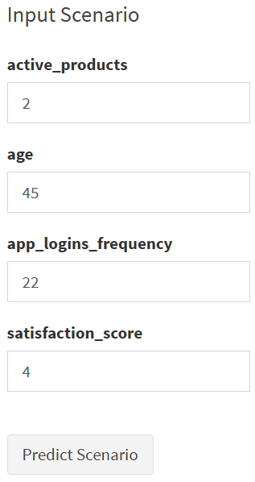{width="211"}                                                                                                                   |
|                                                   |                                                                                                                                                                     |
|                                                   | **Output**                                                                                                                                                          |
|                                                   |                                                                                                                                                                     |
|                                                   | 1.  Prediction result                                                                                                                                               |
|                                                   |                                                                                                                                                                     |
|                                                   |     The output will show predicted churn probability according to the input variable.                                                                               |
|                                                   |                                                                                                                                                                     |
|                                                   | 2.  Desision Path                                                                                                                                                   |
|                                                   |                                                                                                                                                                     |
|                                                   |     The output will shown ....                                                                                                                                      |
+---------------------------------------------------+---------------------------------------------------------------------------------------------------------------------------------------------------------------------+

## 2. Random Forest

**Step 1:** User must choose at least 2 variables and up to 45 variables to be analyze in the model

**Step 2:** User set model parameter

The table below details parameters that can be adjusted to tune the random forest model.

| Model Parameter | Parameter Description |
|----|----|
| 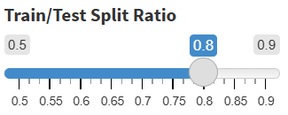 | Controls how the dataset is divided into training and testing sets. For example, 0.8 means 80% of the data is used for training and 20% for testing. |
| 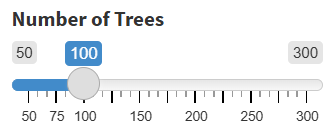 | Defines how many trees are built in the random forest model. |

**Step 3:** User click build model

### Output Result

The result will show model performance and model visulisation.

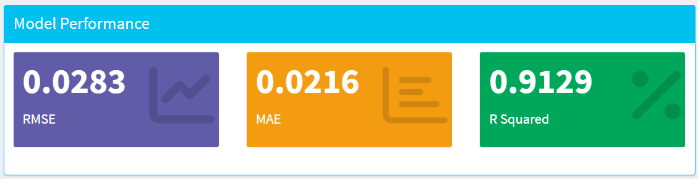

The Model visulisation will be divided into 3 tabs which are Predicted vs Actual, Feature Importance, and Scenario Prediction.

+--------------------------------------+---------------------------------------------------------------------------------------------------------------------------------------------------------------------+
| Model Visulisation                   | Description                                                                                                                                                         |
+======================================+=====================================================================================================================================================================+
| 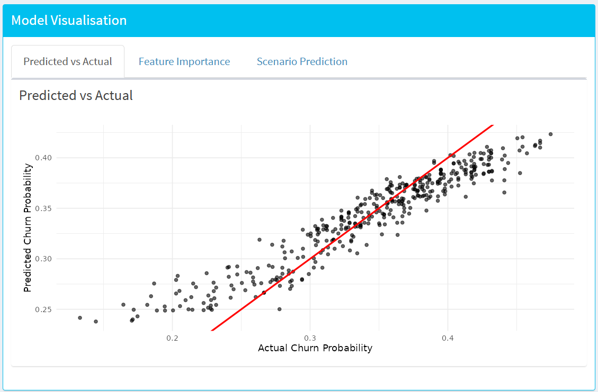 | Compares predicted churn probability with actual churn probability on the test dataset. Points closer to the red diagonal line indicate better prediction accuracy. |
+--------------------------------------+---------------------------------------------------------------------------------------------------------------------------------------------------------------------+
| 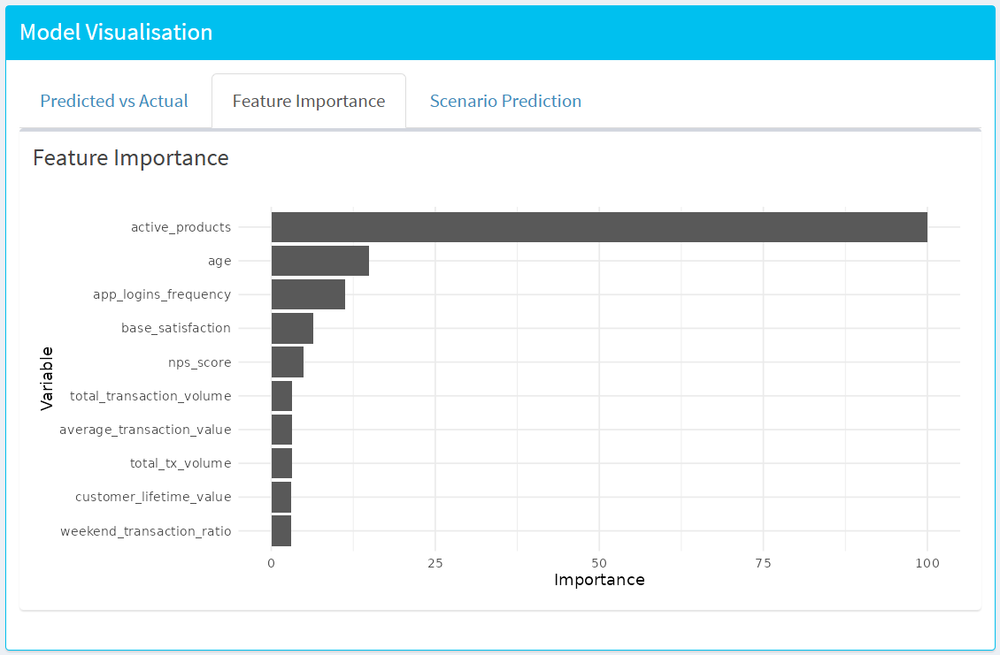 | Shows the top 10 most important variables used in the random forest. Higher values indicate that a variable contributes more to the model’s predictions.            |
+--------------------------------------+---------------------------------------------------------------------------------------------------------------------------------------------------------------------+
| 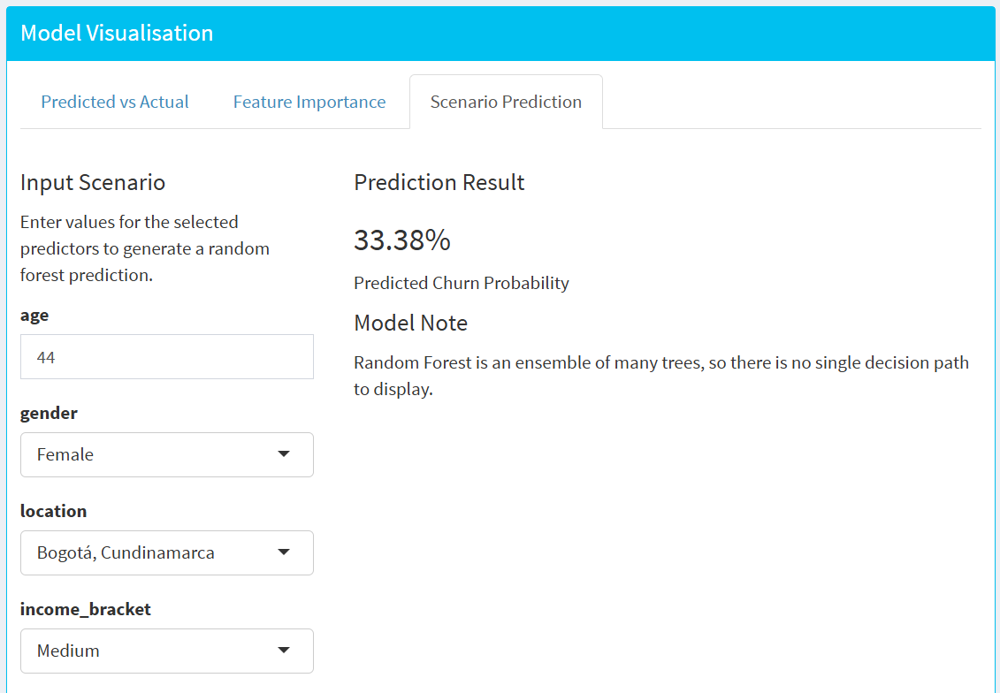 | **Step 1:** User select input scenario                                                                                                                              |
|                                      |                                                                                                                                                                     |
|                                      | **Step 2:** User click Predict Scenario                                                                                                                             |
|                                      |                                                                                                                                                                     |
|                                      | **Output**                                                                                                                                                          |
|                                      |                                                                                                                                                                     |
|                                      | The output will show predicted churn probability according to the input variable.                                                                                   |
+--------------------------------------+---------------------------------------------------------------------------------------------------------------------------------------------------------------------+

# Cluster Analysis Page

**Step 1:** User must choose at least 2 variables and up to 45 variables to be analyze in the cluster

**Step 2:** User set cluster parameter

The table below details parameters that can be adjusted to tune the cluster.

| Model Parameter | Parameter Description |
|----|----|
| 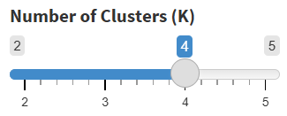 | Defines how many clusters. |
| 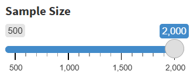 | how many data points (observations) that user want to include when forming clusters. |

**Step 3:** User click Run Clustering

### Output Result

The result will be divided into 4 tabs which are Elbow Method, Cluster Map, Summary Table, Heatmap.

| Elbow Method | Cluster Map | Summary Table | Heatmap |
|----|----|----|----|
| 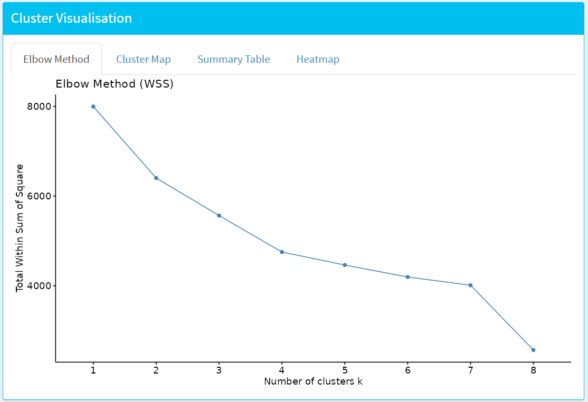 | 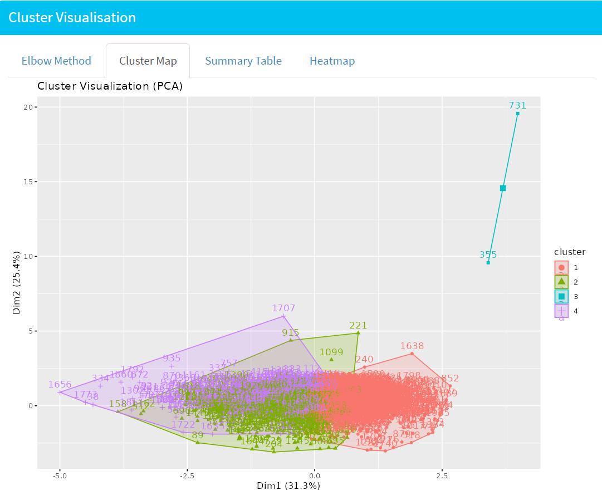 | 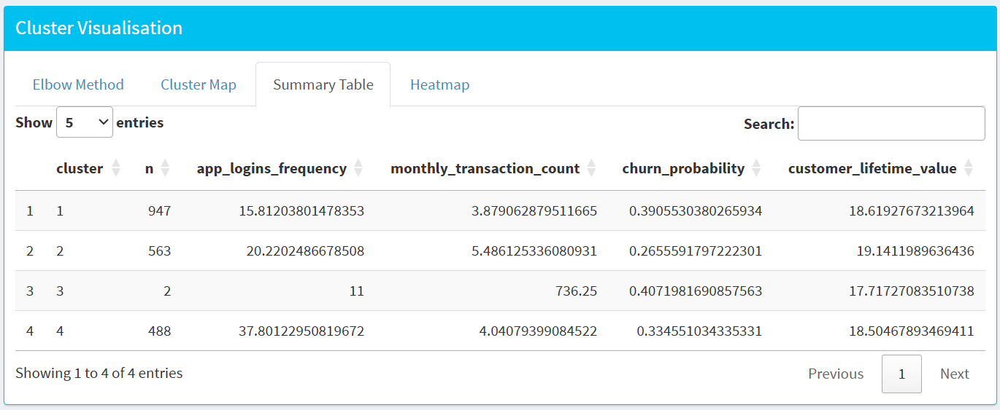 | 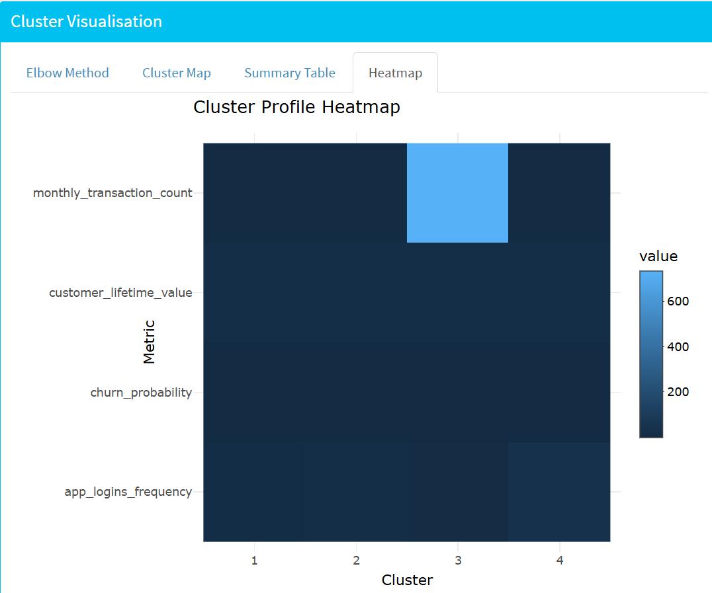 |
